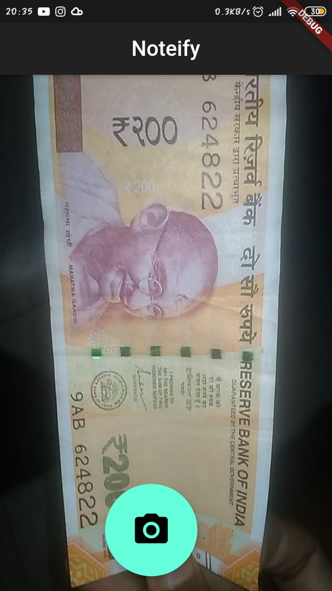
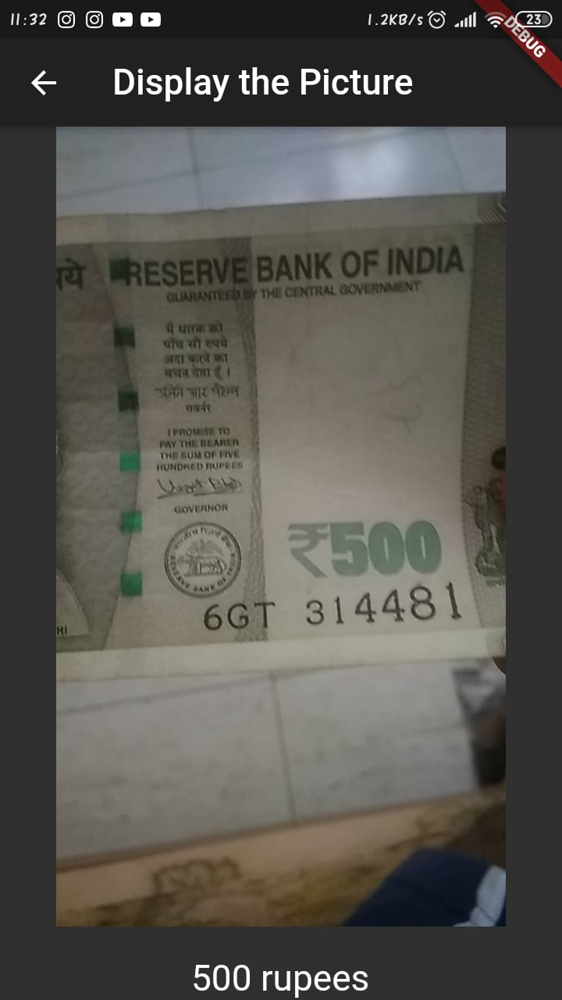

# Noteify 

## Noteify is an artificially intelligent currency detection app made for the visually impaired to check whether they have been handed the right amount of money and thereby, ensuring that they have not been cheated upon, giving the output as a computer-generated audio, having basic UI for better User-Experience. 

## Check out the demo below!
# SORRY, THIS DOES NOT WORK ANYMORE, THE PACKAGES HAVE DEPRECIATED :(
<a href="https://youtu.be/P4t4FfayMzE"> Youtube Video (DEMO) </a>

This is a project done by me and my partners <a href= "https://github.com/Ashniz24"> Ashna Nizam </a>, <a href= "https://github.com/bensam02"> Ben Sam </a>, <a href= "https://github.com/Mannu7789"> Mannu Thomas </a> and <a href= "https://github.com/PeterChageth"> CJ Peter </a> and the app was developed using the Flutter framework.

The main modules used are:

***camera***  
***tflite***  
***flutter_tts***  
***path_provider***

The backend comprises of the tflite package using a tflite model along with the labels which specifies all the classes. The flutter_tts is a text-to-speech module in flutter used to convert text to speech, used here so that the output can be obtained as an audio.

 

**Advantages**
1. No authentication/login required. 
2. No internet connection required. 
3. Highly User-friendly. 
4. Local storage will not be further consumed after installation. 
5. Good-high accuracy in predicting. 
6. A total calculating feature. 
7. Computer-generated audio output. 
8. Automatic initialization of app when it is closed.  

## How to clone
1. Create a flutter app in your local system using android studio and name it Noteify  
2. Download the repo.  
3. Add the files in the **assets** folder into your local system assets folder.  
4. Copy paste *main.dart* and *pubspec.yaml* files from the repo.  
5. Change the **minsdkversion** in the *android/app/build.gradle* to 21.  
6. Copy paste *ios/runner/info.plist* from this repo.
7. Run **packages.get** in *pubspec.yaml*  
8. Optional(To change your app icon to ours, you have to change the minmap folders in your *android/app/src/main/res/* to the ones in the repo).
9. Run the *main.dart* after connecting to your mobile.

<a href="https://youtu.be/Zv6dlV7W8cw"> How to clone tutorial </a>

## Check out CONTRIBUTING.MD to learn how to contribute.

### Note: This project is time being not updated upto the present versions of the packages used, so cloning might not work unless you update the code correspondingly, sorry😅
